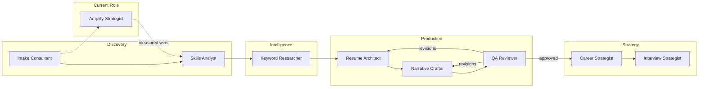
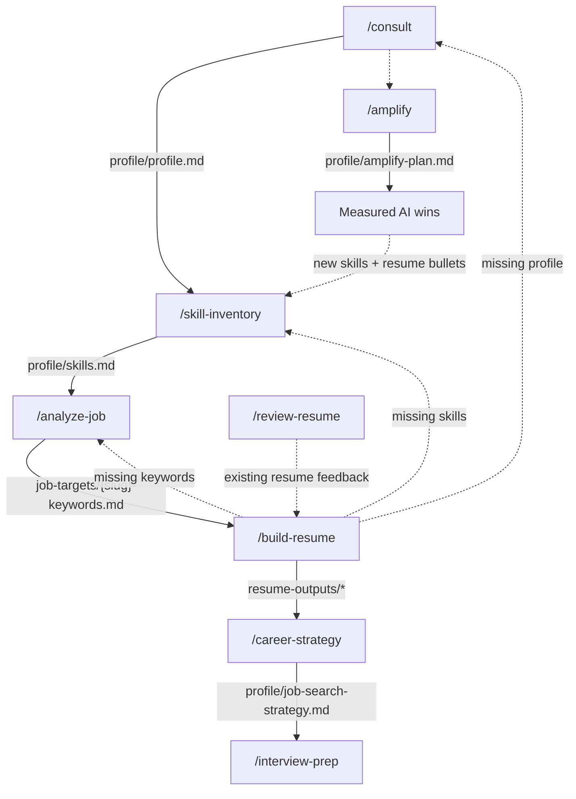
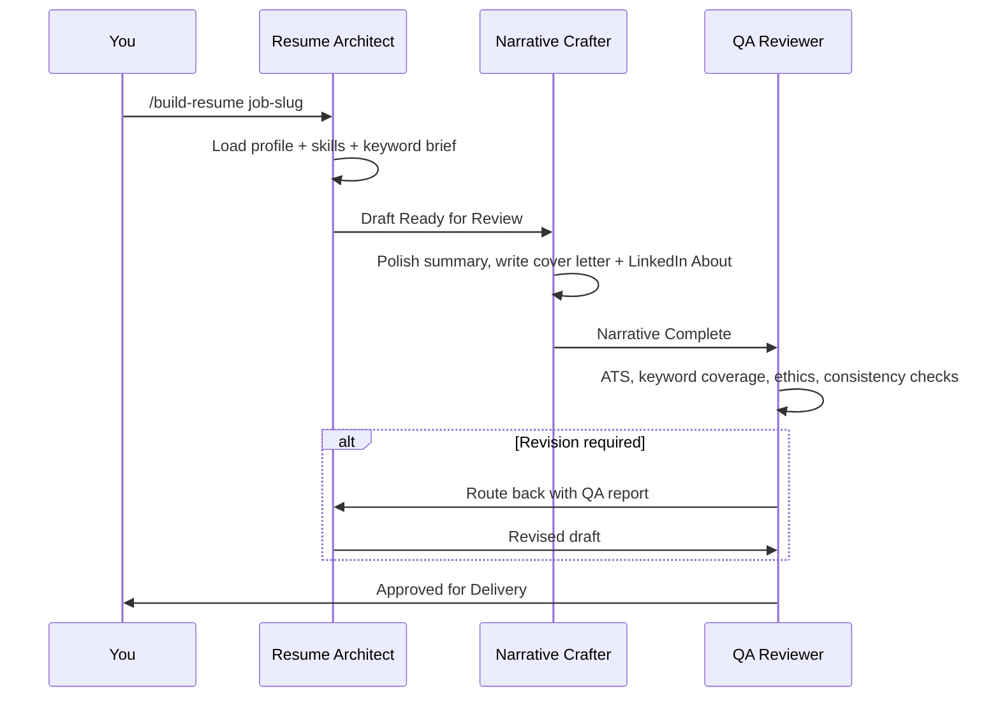

# Career Architect Harness

A **single-user**, multi-agent AI harness built for Claude Code — your personal career team. Nine specialist agents produce tailored resumes, cover letters, job search strategy, interview preparation, and an AI leverage plan for your current job.

> **This is a template repository.** Click **Use this template** to create your own copy — make it **private**, because it will hold your personal career data.

---

## Why (the problem this solves)

Generic resumes lose. Most candidates are filtered out by Applicant Tracking Systems (ATS) before a human ever reads their resume, and most people underestimate their own transferable skills. Doing this well requires several distinct disciplines — skill excavation, keyword intelligence, ATS-compliant writing, storytelling, quality review, search strategy, and interview coaching — that rarely live in one person.

This harness encodes each discipline as a dedicated agent with its own playbook, and wires them into a gated workflow so that:

- **Every output is tailored** to you and a specific job description — never generic
- **Every claim is evidence-backed** — the team philosophy is *"User First, Evidence Always"*; fabrication is a hard stop
- **Nothing skips the line** — a resume can't be built before the skill inventory exists; nothing ships without QA approval

And it works both directions: the job-search pipeline optimizes your *next* role, while `/amplify` optimizes your *current* one — mapping your job to AI leverage opportunities whose measured wins feed back into your resume.

## Who (the team)

Nine specialist agents, each with a defined role, model tier, and an exit state it must reach before the next agent proceeds.

| Agent | Role | Model | Exit State |
|-------|------|-------|------------|
| Intake Consultant | Initial consultation, profile creation | sonnet | Profile Complete |
| Skills Analyst | Skill inventory, latent & transferable skill mapping | sonnet | Skill Inventory Complete |
| Keyword Researcher | Job description analysis, 4-tier keyword extraction | sonnet | Keywords Extracted |
| Resume Architect | Resume construction, ATS optimization | inherit | Draft Ready for Review |
| Narrative Crafter | Professional summary, cover letter, LinkedIn About | inherit | Narrative Complete |
| QA Reviewer | Final quality gate before delivery | inherit | Approved for Delivery |
| Career Strategist | Job search strategy, networking, salary guidance | inherit | Strategy Delivered |
| Interview Strategist | Interview prep, mock interviews, STAR coaching | inherit | Interview Preparation Complete |
| Amplify Strategist | AI leverage mapping for your current role | inherit | Amplify Plan Delivered |

`inherit` means the agent runs on the session's model — heavy-judgment roles always get the most capable model available; conversational/extraction roles run fast on Sonnet. The Career, Interview, and Amplify Strategists carry `WebSearch`/`WebFetch` for live research.



## What (the pieces)

The harness is a collection of Claude Code primitives wired together:

- **Agents** (`.claude/agents/`) — specialist sub-agent definitions with role playbooks, output templates, and handoff rules
- **Commands** (`.claude/commands/`) — slash commands that run pre-flight prerequisite checks, then invoke the right agent
- **Skills** (`.claude/skills/`) — domain expertise modules (ATS rules, bullet formulas, negotiation scripts, AI leverage patterns) that agents load as needed; not invoked directly by users
- **Team config** (`.claude/team-config.json`) — the roster, workflow order, and stop-the-line conditions in machine-readable form

| Command | What It Does |
|---------|-------------|
| `/consult` | Start here — intake interview, saves your profile |
| `/skill-inventory` | Full skill inventory: hard, soft, latent, and transferable skills |
| `/analyze-job` | Analyze a job description — 4-tier ATS keywords, gap analysis |
| `/build-resume [job-slug]` | Tailored resume + cover letter + LinkedIn About, QA-gated |
| `/review-resume` | Critical review of your existing resume with example rewrites |
| `/career-strategy` | Job search channels, target companies, networking, 30-day plan |
| `/interview-prep [job-slug]` | Prep plan, STAR story bank, scored mock interviews, research brief |
| `/amplify` | Map your current job to AI leverage — quick wins, quarter plays, measured impact |

| Skill | Used By | Purpose |
|-------|---------|---------|
| `ats-optimization` | Resume Architect, QA Reviewer | ATS formatting rules, keyword placement, anti-patterns |
| `resume-patterns` | Resume Architect, Narrative Crafter, QA Reviewer | Bullet formulas, summary patterns, section templates, length rules |
| `skill-translation` | Skills Analyst | Latent/transferable skill identification frameworks |
| `career-strategy-patterns` | Career Strategist, Interview Strategist | Search tactics, outreach templates, negotiation scripts |
| `interview-frameworks` | Interview Strategist, Career Strategist | Question banks, STAR story bank template, research protocol |
| `linkedin-optimization` | Narrative Crafter, Career Strategist | Recruiter search ranking, profile optimization |
| `amplify-patterns` | Amplify Strategist | Task taxonomy, automate/augment rubric, measurement, governance |

Each fact lives in exactly one skill — agents reference the skill files rather than embedding copies, so updates land in one place and never drift.

## How (the workflow)

Each slash command runs pre-flight checks against the files earlier steps produced. If a prerequisite is missing, the command halts and routes you to the correct prior step — this is the gating mechanism. `/amplify` is the exception: it runs standalone at any time, though it reads your profile when it exists.



`/build-resume` itself is a three-phase pipeline with a QA revision loop:



Every file the harness produces:

| File | Contents |
|------|----------|
| `profile/profile.md` | Your career goals, background, target roles |
| `profile/skills.md` | Full skill inventory with gap analysis |
| `profile/job-search-strategy.md` | Channels, company tiers, 30-day plan |
| `profile/interview-prep.md` | Prep plan, STAR bank, mock scores, action items |
| `profile/amplify-plan.md` | Task inventory, AI plays, measurement log, guardrails |
| `job-targets/{slug}-keywords.md` | Tier 1–4 keywords, gap analysis, title recommendation |
| `resume-outputs/{slug}-resume.md` | ATS-optimized tailored resume |
| `resume-outputs/{slug}-cover-letter.md` | Targeted cover letter |
| `resume-outputs/linkedin-about.md` | LinkedIn About section |
| `resume-outputs/{slug}-qa-report.md` | QA review with APPROVED/REVISION status |

## When (which command, which moment)

| Situation | Start Here |
|-----------|-----------|
| Just created your copy of this template | `/consult` — everything begins with a profile |
| You have a resume and want honest feedback | `/review-resume` — critique first, rebuild after |
| Found a job posting to target | `/analyze-job` — keywords before any writing |
| Ready to apply to a specific role | `/build-resume` — requires profile + skills + keywords |
| Application is out, search feels scattered | `/career-strategy` — channels, targets, weekly plan |
| Interview scheduled | `/interview-prep` — works with ≤3 days (triage), 1 week, or 2+ weeks |
| Happy in your job, want to perform better | `/amplify` — AI leverage plan for your current role |
| 30 days after starting your Amplify Plan | `/amplify` again — measure wins, expand plays |

Repeat `/analyze-job` + `/build-resume` for each target role — your profile and skill inventory are reused.

## Getting Started

1. Click **Use this template** on GitHub → create a **private** repository (it will hold your personal career data)
2. Clone your copy and open it in Claude Code
3. Run `/consult` and follow the intake interview
4. Follow the recommended next step each command gives you

```
/consult → /skill-inventory → /analyze-job → /build-resume → /career-strategy → /interview-prep
                └──────────────── /amplify (current role, any time) ────────────────┘
```

## Stop-the-Line Rules

Any agent will halt work and route back if:

- **Career goals are undefined** — return to `/consult`
- **No target job description** — required before `/analyze-job` can run
- **Skill inventory incomplete** — `/skill-inventory` must complete before `/build-resume`
- **Fabricated credentials detected** — work stops immediately
- **An Amplify play would put confidential data into unsanctioned AI tools** — halted and redesigned

## Repository Structure

```
.claude/
├── agents/               # Specialist agent definitions
├── commands/             # Slash command workflows
├── skills/               # Domain expertise modules
├── team-config.json      # Agent roster and workflow config
profile/                  # Your profile, skills, strategies, amplify plan
job-targets/              # Saved job descriptions and keyword briefs
resume-outputs/           # Resume drafts, cover letters, QA reports
patterns_library/         # Reusable resume patterns and templates
CLAUDE.md                 # Team philosophy, workflow rules, stop-the-line conditions
```

## Ethics

- No fabricated accomplishments, credentials, employers, or dates
- Your career data stays in your private repository
- Embellished content is flagged, not silently accepted
- Every recommendation is grounded in your actual experience and the job's real requirements
- Amplify plays respect your company's AI policy and never expose confidential data
