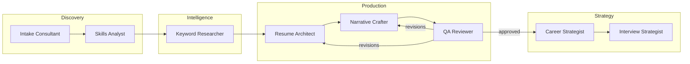
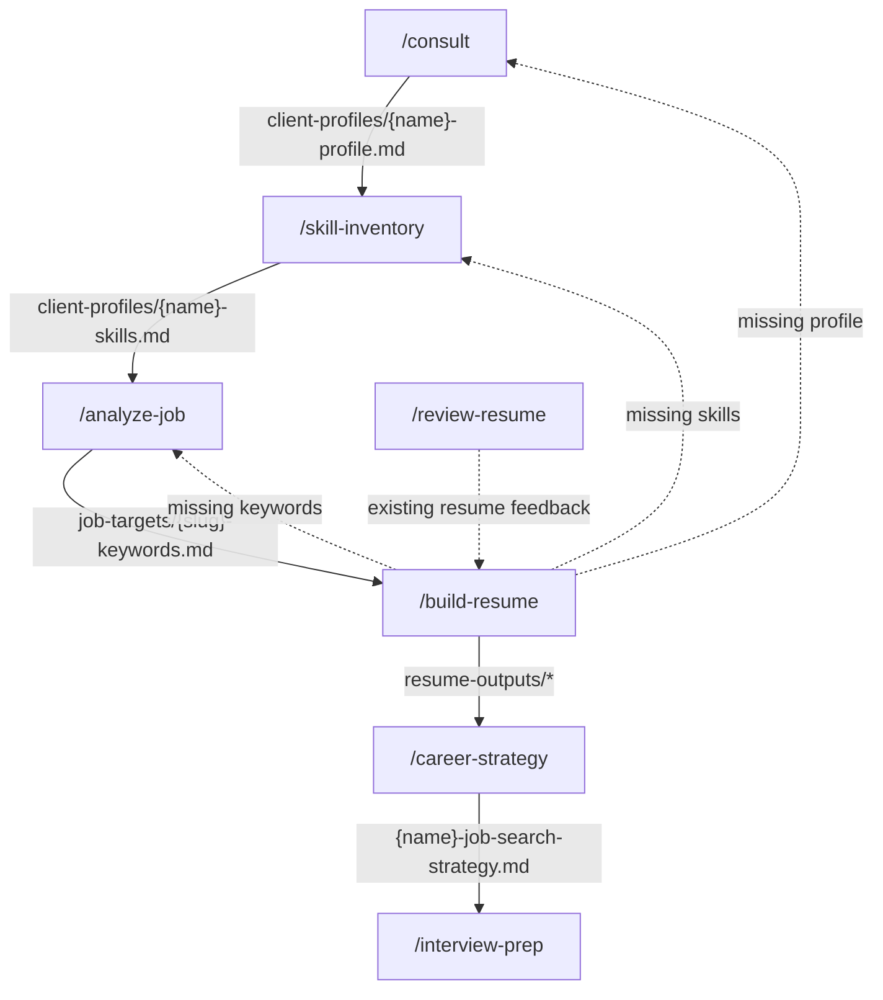
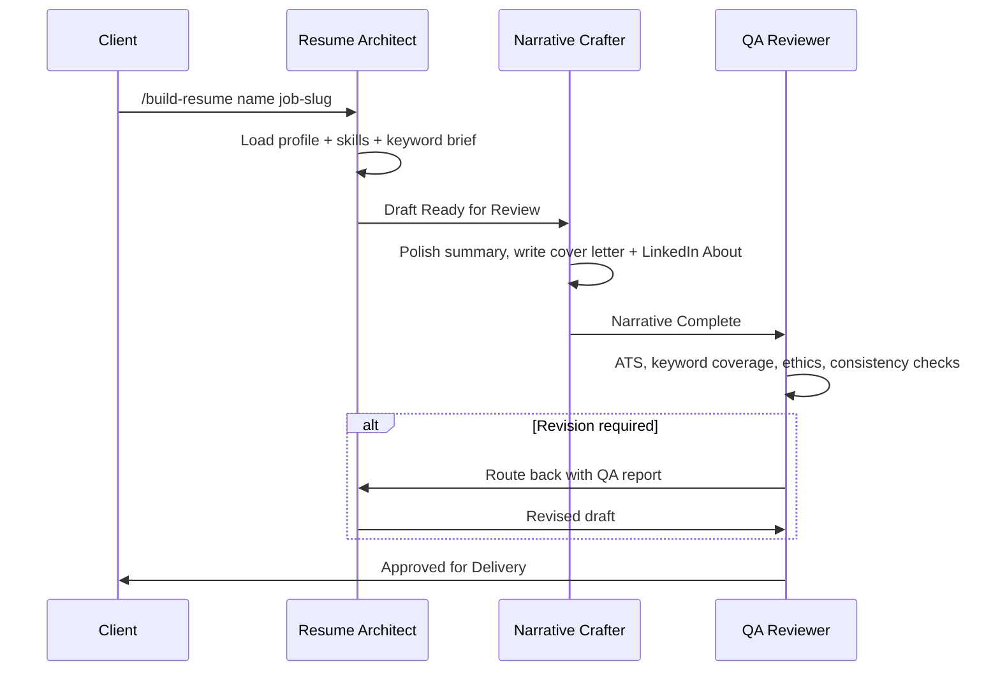

# Career Architect Harness

A multi-agent AI harness built for Claude Code that transforms job seekers' skills and experiences into compelling career narratives — customized resumes, cover letters, job search strategy, and interview preparation, produced by a coordinated team of specialist agents.

---

## Why (the problem this solves)

Generic resumes lose. Most candidates are filtered out by Applicant Tracking Systems (ATS) before a human ever reads their resume, and most job seekers underestimate their own transferable skills. Doing this well by hand requires several distinct disciplines — skill excavation, keyword intelligence, ATS-compliant writing, storytelling, quality review, search strategy, and interview coaching — that rarely live in one person.

This harness encodes each discipline as a dedicated agent with its own playbook, and wires them into a gated workflow so that:

- **Every output is tailored** to a specific client and a specific job description — never generic
- **Every claim is evidence-backed** — the team philosophy is *"Client First, Evidence Always"*; fabrication is a hard stop
- **Nothing skips the line** — a resume can't be built before the skill inventory exists; nothing ships without QA approval

## Who (the team)

Eight specialist agents, each with a defined role, model tier, and an exit state it must reach before the next agent proceeds.

| Agent | Role | Model | Exit State |
|-------|------|-------|------------|
| Intake Consultant | Initial consultation, client profile creation | sonnet | Client Profile Complete |
| Skills Analyst | Skill inventory, latent & transferable skill mapping | sonnet | Skill Inventory Complete |
| Keyword Researcher | Job description analysis, 4-tier keyword extraction | sonnet | Keywords Extracted |
| Resume Architect | Resume construction, ATS optimization | inherit | Draft Ready for Review |
| Narrative Crafter | Professional summary, cover letter, LinkedIn About | inherit | Narrative Complete |
| QA Reviewer | Final quality gate before delivery | inherit | Approved for Delivery |
| Career Strategist | Job search strategy, networking, salary guidance | inherit | Strategy Delivered |
| Interview Strategist | Interview prep, mock interviews, STAR coaching | inherit | Interview Preparation Complete |

`inherit` means the agent runs on the session's model — the heavy-judgment roles always get the most capable model available; the conversational/extraction roles run fast on Sonnet. The Career and Interview Strategists also carry `WebSearch`/`WebFetch` for live company research and salary benchmarking.



## What (the pieces)

The harness is a collection of Claude Code primitives wired together:

- **Agents** (`.claude/agents/`) — specialist sub-agent definitions with role playbooks, output templates, and handoff rules
- **Commands** (`.claude/commands/`) — slash commands that run pre-flight prerequisite checks, then invoke the right agent
- **Skills** (`.claude/skills/`) — domain expertise modules (ATS rules, bullet formulas, negotiation scripts) that agents load as needed; not invoked directly by users
- **Team config** (`.claude/team-config.json`) — the roster, workflow order, and stop-the-line conditions in machine-readable form

| Command | What It Does |
|---------|-------------|
| `/consult [client-name]` | Start a new engagement — intake interview, saves client profile |
| `/skill-inventory [client-name]` | Full skill inventory: hard, soft, latent, and transferable skills |
| `/analyze-job [client-name]` | Analyze a job description — 4-tier ATS keywords, gap analysis |
| `/build-resume [client-name] [job-slug]` | Tailored resume + cover letter + LinkedIn About, QA-gated |
| `/review-resume [client-name]` | Critical review of an existing resume with example rewrites |
| `/career-strategy [client-name]` | Job search channels, target companies, networking, 30-day plan |
| `/interview-prep [client-name] [job-slug]` | Prep plan, STAR story bank, scored mock interviews, research brief |

| Skill | Used By | Purpose |
|-------|---------|---------|
| `ats-optimization` | Resume Architect, QA Reviewer | ATS formatting rules, keyword placement, anti-patterns |
| `resume-patterns` | Resume Architect | Bullet formulas, section templates, length rules |
| `skill-translation` | Skills Analyst | Latent/transferable skill identification frameworks |
| `career-strategy-patterns` | Career Strategist | Search tactics, outreach templates, negotiation scripts |
| `interview-frameworks` | Interview Strategist | Question banks, STAR coaching, delivery guidance |
| `linkedin-optimization` | Narrative Crafter, Career Strategist | Recruiter search ranking, profile optimization |

## How (the workflow)

Each slash command runs pre-flight checks against the files earlier steps produced. If a prerequisite is missing, the command halts and routes you to the correct prior step — this is the gating mechanism.



`/build-resume` itself is a three-phase pipeline with a QA revision loop:



Every file the harness produces, per client + target role:

| File | Contents |
|------|----------|
| `client-profiles/{name}-profile.md` | Career goals, background, target roles |
| `client-profiles/{name}-skills.md` | Full skill inventory with gap analysis |
| `job-targets/{slug}-keywords.md` | Tier 1–4 keywords, gap analysis, title recommendation |
| `resume-outputs/{name}-{slug}-resume.md` | ATS-optimized tailored resume |
| `resume-outputs/{name}-{slug}-cover-letter.md` | Targeted cover letter |
| `resume-outputs/{name}-linkedin-about.md` | LinkedIn About section |
| `resume-outputs/{name}-{slug}-qa-report.md` | QA review with APPROVED/REVISION status |
| `client-profiles/{name}-job-search-strategy.md` | Channels, company tiers, 30-day plan |
| `client-profiles/{name}-interview-prep.md` | Prep plan, STAR bank, mock scores, action items |

## When (which command, which moment)

| Situation | Start Here |
|-----------|-----------|
| Brand-new client, no materials | `/consult` — everything begins with a profile |
| Client has a resume and wants honest feedback | `/review-resume` — critique first, rebuild after |
| Client found a job posting to target | `/analyze-job` — keywords before any writing |
| Ready to apply to a specific role | `/build-resume` — requires profile + skills + keywords |
| Application is out, search feels scattered | `/career-strategy` — channels, targets, weekly plan |
| Interview scheduled | `/interview-prep` — works with ≤3 days (triage), 1 week, or 2+ weeks |

The full sequence for a new client:

```
/consult → /skill-inventory → /analyze-job → /build-resume → /career-strategy → /interview-prep
```

Repeat `/analyze-job` + `/build-resume` for each additional target role — the profile and skill inventory are reused.

## Quickstart

```
/consult Jane Smith
```
Follow the intake interview. A profile is saved to `client-profiles/jane-smith-profile.md`.

```
/skill-inventory jane-smith
/analyze-job jane-smith
/build-resume jane-smith <job-slug>
/career-strategy jane-smith
/interview-prep jane-smith <job-slug>
```

Each step gates the next; if you skip one, the command tells you exactly what to run first.

## Repository Structure

```
.claude/
├── agents/               # Specialist agent definitions
├── commands/             # Slash command workflows
├── skills/               # Domain expertise modules
├── team-config.json      # Agent roster and workflow config
client-profiles/          # Created per client — profiles, skill inventories, prep plans
job-targets/              # Saved job descriptions and keyword briefs
resume-outputs/           # Final resume drafts, cover letters, QA reports
patterns_library/         # Reusable resume patterns and templates
CLAUDE.md                 # Team philosophy, workflow rules, stop-the-line conditions
```

## Stop-the-Line Rules

Any agent will halt work and route back if:

- **Client goals are undefined** — return to `/consult`
- **No target job description** — required before `/analyze-job` can run
- **Skill inventory incomplete** — `/skill-inventory` must complete before `/build-resume`
- **Fabricated credentials detected** — work stops immediately, client is notified

## Ethics

- No fabricated accomplishments, credentials, employers, or dates
- All client data treated as confidential
- Embellished content is flagged, not silently accepted
- Every recommendation is grounded in the client's actual experience and the job's real requirements
